# 64132120-AndroidProgramming

#        KẾT QUẢ APP THỰC HIỆN

### Tính tổng 2 số tự nhiên

[CT tính Tổng STN](Ex3_SimpleSumApp)

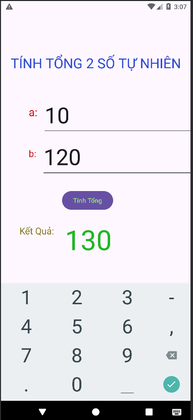

##    CÁC PHÉP TÍNH CƠ BẢN

[CT tính +-*/](Ex4_AddSubMulDiv_Onclick)

### Tính Cộng

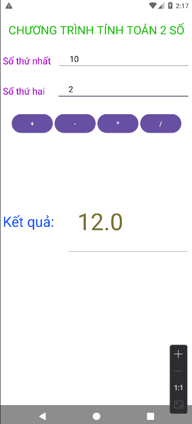

### Tính Trừ

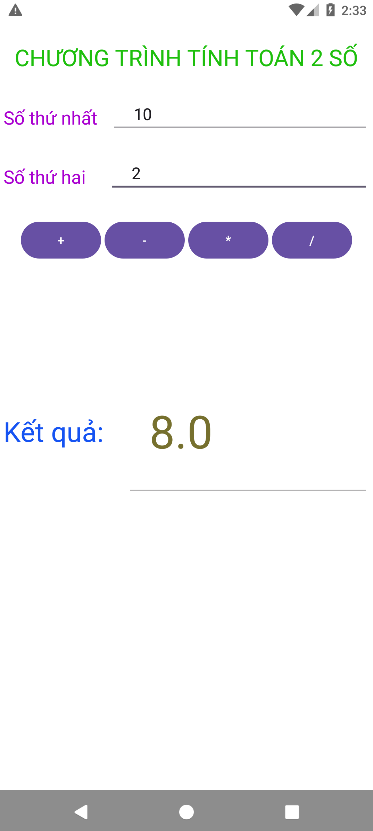

### Tính Nhân

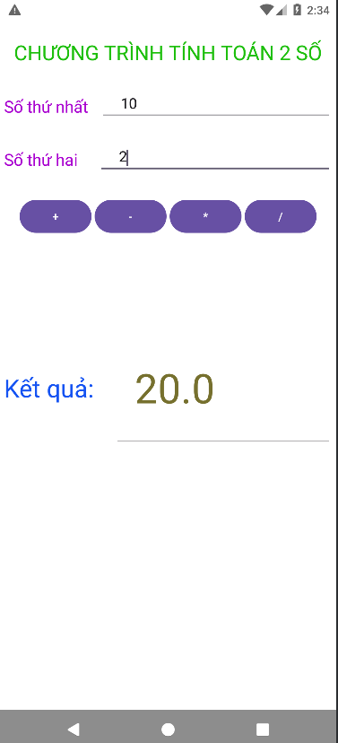

### Tính Chia

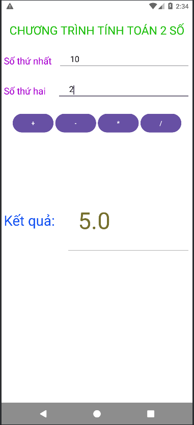
 

##    Tính BMI cơ thể

[CT tính BMI](TinhBMI)

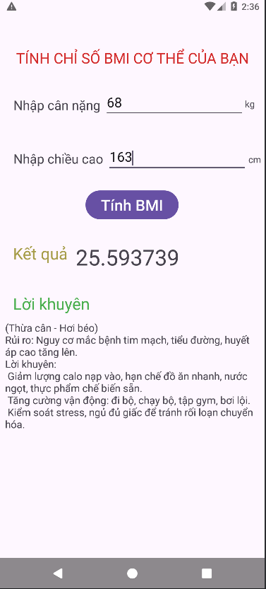

##    TÍNH DIỆN TÍCH, CHU VI TAM GIÁC

[CT tính tam giac](ChuViDienTich_HinhTamGiac)

### Tính Diện tích

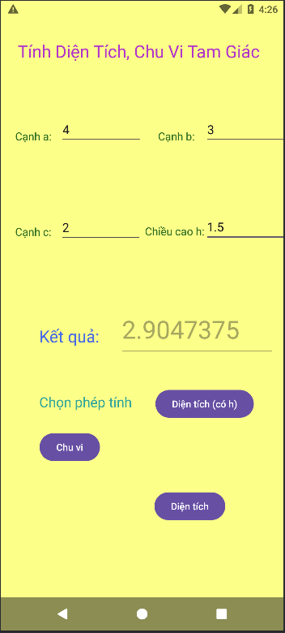

### Tính Diện tích dùng chiều cao

### Tính Chu vi

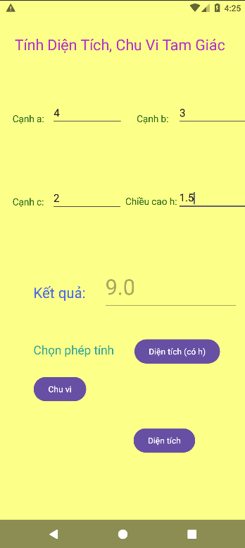

##    TÍNH DIỆN TÍCH, CHU VI HÌNH TRÒN

[CT tính hình tròn](ChuViDienTich_HinhTron)

### Tính Diện tích Hình Tròn

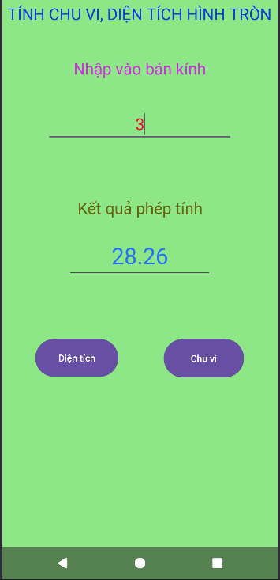

### Tính Chu Vi Hình Tròn

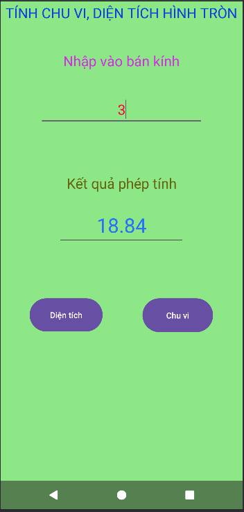

##    TÍNH DIỆN TÍCH, CHU VI HÌNH TỨ GIÁC

[CT tính tứ giác](ChuViDienTich_HinhTuGIac)

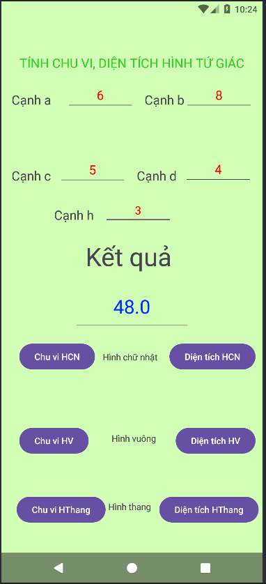

##    INTENT(CHUYỂN TRANG)

[CT intent](Ex7_IntentLogin)

### Trang Chính

### Trang Đăng nhập 

### Trang Chủ 
(Đăng nhập với tư cách Khách sẽ không hiển thị tên)

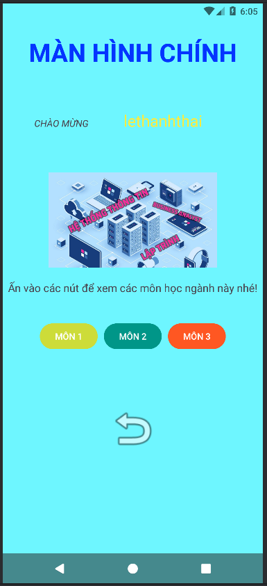

### Trang xem Môn 1

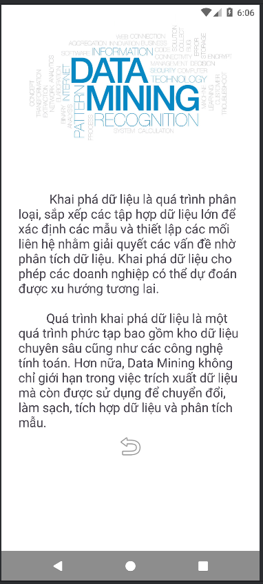

### Trang xem Môn 2

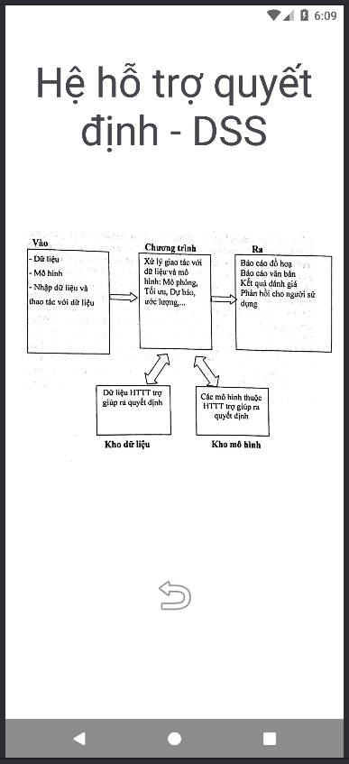

### Trang xem Môn 3

