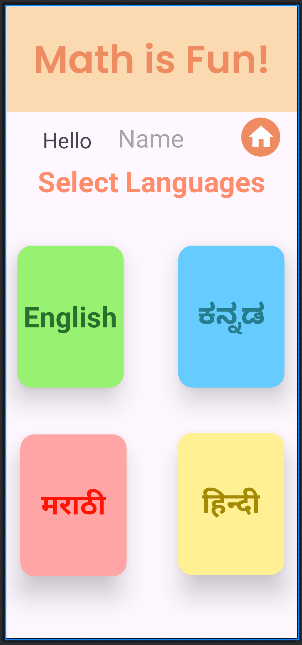

# 64132120-AndroidProgramming

#        KẾT QUẢ APP THỰC HIỆN

### Tính tổng 2 số tự nhiên

[Chương trình tính Tổng STN](Ex3_SimpleSumApp)

##    CÁC PHÉP TÍNH CƠ BẢN

[Chương trình tính + - * /](Ex4_AddSubMulDiv_Onclick)

### Tính Cộng

### Tính Trừ

### Tính Nhân

### Tính Chia

 

##    Tính BMI cơ thể

[Chương trình tính BMI](TinhBMI)

##    TÍNH DIỆN TÍCH, CHU VI TAM GIÁC

[Chương trình tính tam giác](ChuViDienTich_HinhTamGiac)

### Tính Diện tích

### Tính Diện tích dùng chiều cao

### Tính Chu vi

##    TÍNH DIỆN TÍCH, CHU VI HÌNH TRÒN

[Chương trình tính hình tròn](ChuViDienTich_HinhTron)

### Tính Diện tích Hình Tròn

### Tính Chu Vi Hình Tròn

##    TÍNH DIỆN TÍCH, CHU VI HÌNH TỨ GIÁC

[Chương trình tính tứ giác](ChuViDienTich_HinhTuGIac)

##    INTENT(CHUYỂN TRANG)

[Chương trình Intent](Ex7_IntentLogin)

### Trang Chính

### Trang Đăng nhập 

### Trang Chủ 
(Đăng nhập với tư cách Khách sẽ không hiển thị tên)

### Trang xem Môn 1

### Trang xem Môn 2

### Trang xem Môn 3

##    BẢNG CỬU CHƯƠNG 1

[Chương trình Bảng cửu chương 1](Phep_Cuu_Chuong)

##    SỬ DỤNG COMPLETE TEXTVIEW VÀ LISTVIEW 

[Chương trình](UseAutoCompleteTV_ListView/)

### Trang chủ

### Tìm kiếm

##    TRANG LOGIN CƠ BẢN

[Chương trình Trang Login Cơ bản](Easy_Login_Page/)

### Đăng nhập thành công

### Đăng nhập thất bại

##    TRANG DASHBOARD 

[Chương trình Dashboard](Dashboard)

### Trang chủ

### Trang các thiết bị điện tử

### Đăng nhập thất bại

##    TRANG APP MATH FOR KIDS DÙNG FIGMA 

[Chương trình ](Mathappforkids_Figma/)

### Trang Đăng nhập

### Trang chủ

##    TRANG RecyclerView LandScape

[Chương trình RecyclerView ](RecyclerView)

### Trang chủ

##    GIỮA KÌ

[Chương trình](64132120_ThiGiuaKy)

 

## FRAGMENT

### Fragment dùng Static

[Fragment Static](Fragments)

[Fragment Static](FragmentExAddDynamic)

[Fragment Static](FragmentExReplace)

